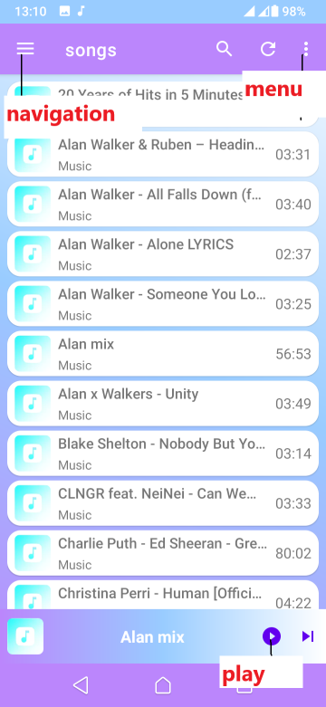
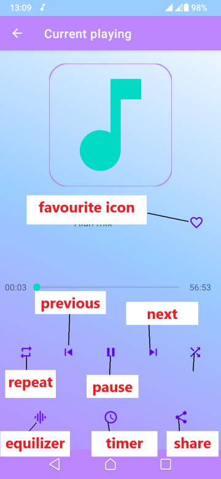

# Music Player

## Description

The objective of this player is to provide android users with the best music experience by systematically
assembling all audio files together. The user can choose the music file to play by clicking on it, create
a playlist and regroup the music files, create a favorite list of files, remove files without permanently
deleting them or view a file details.

## Features

The player consist of various features, regrouped according to player screens. The screens include the main
and active player screen.

### Main screen
The main screen is the display screen that appears immediately after launching the app. The screen consist
of a navigation and menu button (three dots in the top right corner) that leads to the navigation panel and menu items respectively.

#### Navigation panel features

| Feature    | Functionality                  |
|------------|--------------------------------|
| settings   | opens the player settings      |
| feedback   | opens the feedback section     |
| about      | opens the player about section |
| favourites | opens the favourite section    |
| playlists  | opens the playlist section     |

#### Menu items
| item            | Functionality               |
|-----------------|-----------------------------|
| favourite songs | opens the favourite section |
| playlists       | opens the playlist section  |

### Active player screen
Active player screen is the display screen that appears immediately after clicking a song to play from the 
main screen.

| Feature        | Functionality                                  |
|----------------|------------------------------------------------|
| Play icon      | Play songs                                     |
| Pause icon     | Pause songs                                    |
| previous       | play previous song                             |
| next           | play next song                                 |
| Favourite icon | Add song to favourite list                     |
| Repeat icon    | play in repeat mode                            |
| shuffle icon   | play in shuffle mode                           |
| Share icon     | Share current playing song                     |
| Timer icon     | Set the duration the player should stay active |
| Equalizer icon | Open phone equalizer settings                  |

## App download
The app is currently not available in google playstore. It can be downloaded from my website via the link 
https://erastus.pythonanywhere.com/blog/download/.
or if you are familiar with kotlin android programming, you can fork the repository to get a personal copy, clone 
the repository to get a local copy to your system, open the project with android studio and then generate a 
signed apk.

## Usage
The player is compatible with android devices with an API level of 21 and above. The following is a list of
step on how to use the app after installation. 
1. Launch the app.
2. click on a song to play.
3. Explore active player screen features as per your choice.

The player will then open a notification channel with player controls (appears on top of your screen) and 
display a current playing fragment at the bottom of the main screen.

## Author
Erastus Nzula, 2022

## Contribution
The project is open to contributions.
